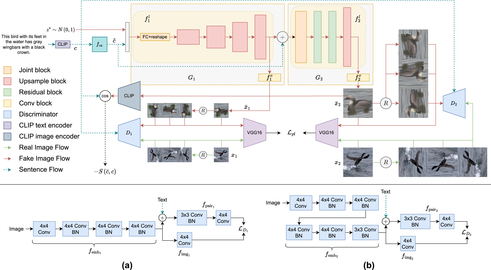
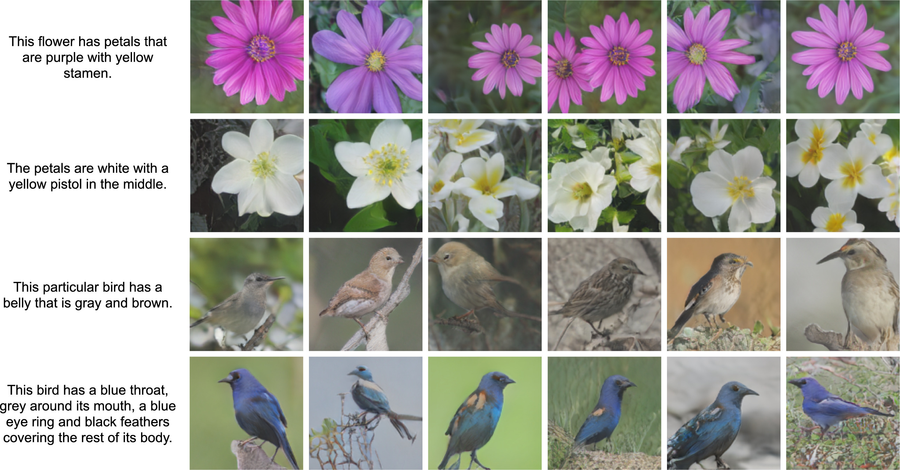

# LAP-GAN: Label augmentation with perceptual loss for self-supervised text-to-image synthesis

This repository provides the **pytorch** code for the paper "[LAP-GAN: Label augmentation with perceptual loss for self-supervised text-to-image synthesis](https://doi.org/10.1016/j.eswa.2025.129005)" by Yong Xuan Tan, Jit Yan Lim, Kian Ming Lim, Chin Poo Lee.



## Environment
The code is tested on Windows 10 with Anaconda3 and following packages:
- python 3.7.11
- pytorch 1.9.0
- torchvision 0.10.0

## Dataset
For Oxford flower and CUB-200, please download the preprocessed metadata and images from [SSTIS](https://github.com/Jityan/SSTIS). For COCO, please download the preprocessed metadata and images from [AttnGAN](https://github.com/taoxugit/AttnGAN).

Put them into `./data/flowers`, `./data/birds`, and `./data/coco` folder. Rename the text_c10 folder into text.

## Experiments
To train on Oxford:<br/>
```
python main.py --dataset-name flowers --exp-num oxford_exp
```
To evaluate on Oxford:<br/>
```
python main.py --dataset-name flowers --exp-num oxford_exp --is-test
```

## Pre-trained Models
Download the [pretrained models](https://drive.google.com/file/d/1V40STbG1HUtmW1yxkbKle4pe44lryp--/view?usp=sharing). Extract it to the `saved_model` folder.

Examples generated by SSBi-GAN:


## Citation
If you find this repo useful for your research, please consider citing the paper:
```
@article{TAN2026129005,
  title = {LAP-GAN: Label augmentation with perceptual loss for self-supervised text-to-image synthesis},
  journal = {Expert Systems with Applications},
  volume = {296},
  pages = {129005},
  year = {2026},
  issn = {0957-4174},
  doi = {https://doi.org/10.1016/j.eswa.2025.129005},
  url = {https://www.sciencedirect.com/science/article/pii/S0957417425026223},
  author = {Yong Xuan Tan and Jit Yan Lim and Kian Ming Lim and Chin Poo Lee}
}
```

## Contacts
For any questions, please contact: <br/>

Yong Xuan Tan (yongxuan95@gmail.com) <br/>
Jit Yan Lim (jityan95@gmail.com)

## Acknowlegements
- [Text-to-Image Synthesis](https://github.com/aelnouby/Text-to-Image-Synthesis)
- [StackGAN](https://github.com/hanzhanggit/StackGAN)
- [StackGAN++](https://github.com/hanzhanggit/StackGAN-v2)
- [HDGAN](https://github.com/ypxie/HDGan)
- [SS-GAN](https://github.com/vandit15/Self-Supervised-Gans-Pytorch)
- [AttnGAN](https://github.com/taoxugit/AttnGAN)
- [GALIP](https://github.com/tobran/GALIP)

## License
This code is released under the MIT License (refer to the LICENSE file for details).
